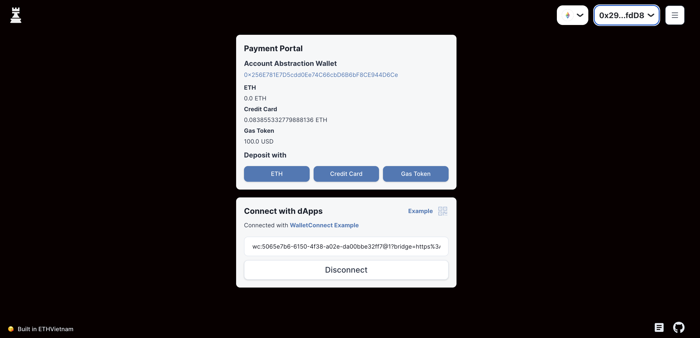
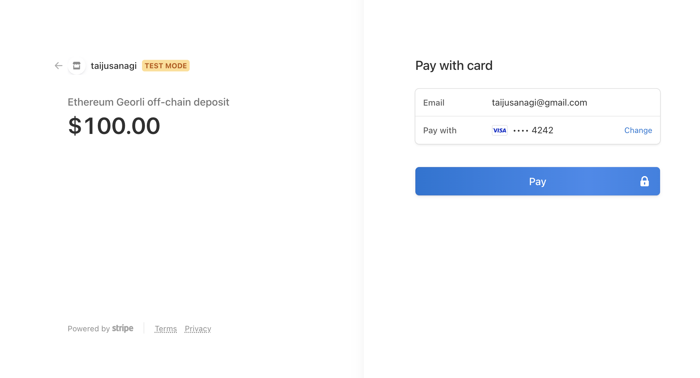
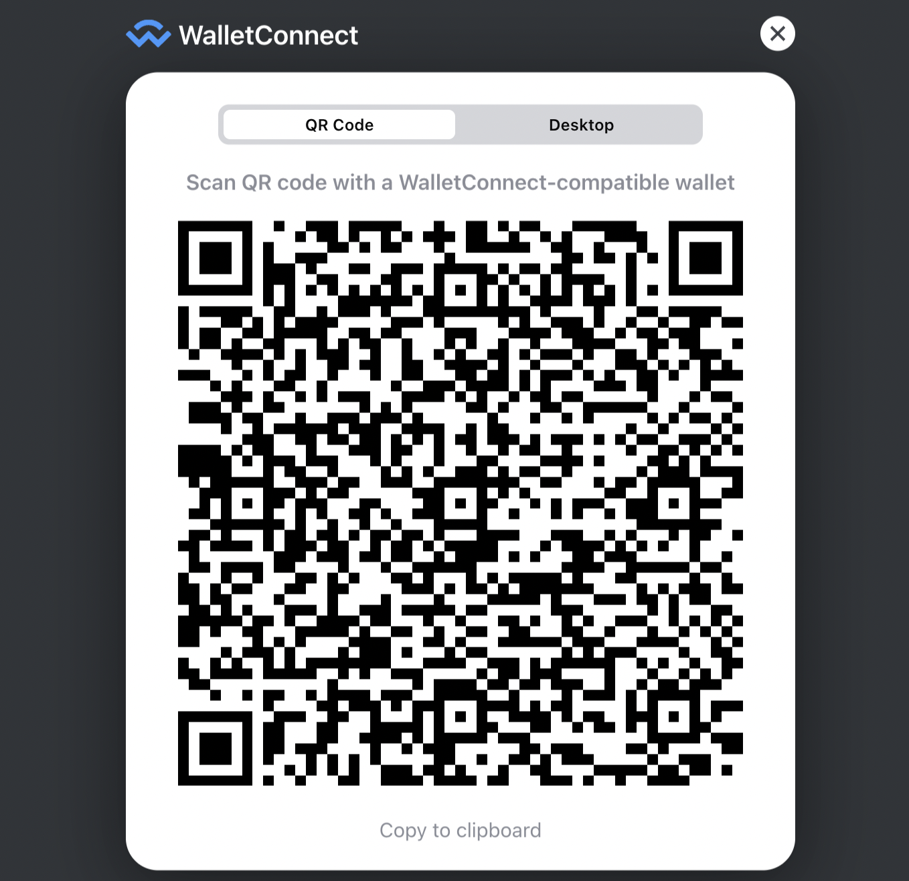
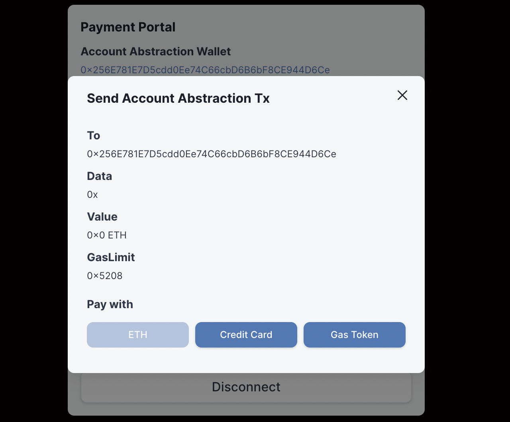
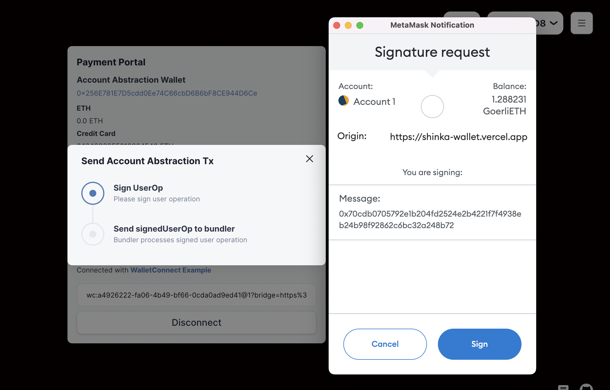
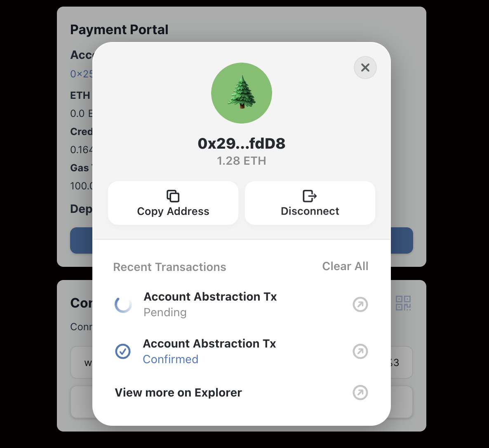

## How to use

- Choose deposit options
  

- Credit card deposit example
  

- After deposit complete, get wallet connect URI
  

- After connected, call tx, then choose payment option
  

- Then confirm tx
  

- Tx history can be checked at wallet icon button
  
