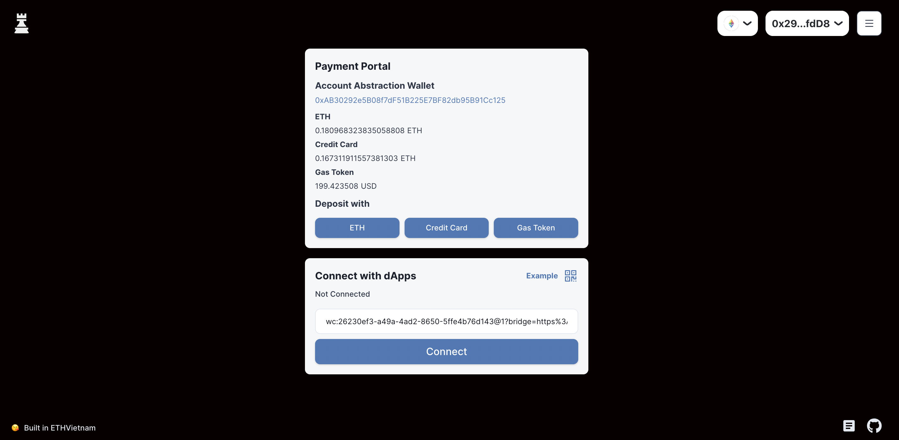
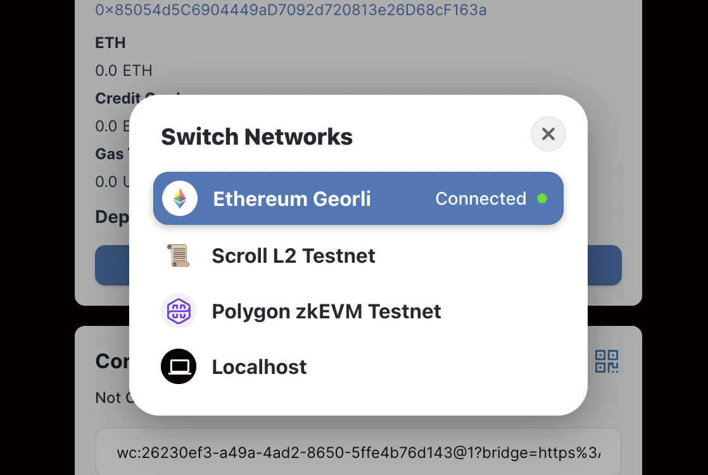

# Shinka Wallet

Shinka Wallet is An Account Abstraction portal to use gas-free and off-chain payment with the L2 network.

## Submission

### Demo Video

https://youtu.be/CLsDSZ245bc

### Pitch Deck

https://docs.google.com/presentation/d/14piDztLUy94ZevsPwf9DraEytryf2i7lF0cOqmlBI_M/edit?usp=sharing

### Live Demo

https://shinka-wallet.vercel.app/

## Bounty

- Dorahack - AccountAbstraction for paymaster infrastructure
- Scroll for using Scroll L2 testnet
- Polygon for using Mumbai and zkEVM

## Description

This is An Account Abstraction paymaster portal, users can connect their wallet and upgrade it into an Account Abstraction wallet with flexible payment methods. For this hackathon, we focused on paymaster in Account Abstraction. because we believe that removes so many users' obstacles to joining the crypto space.

Also, we implemented social recovery in the contract logic.

This paymaster infrastructure can be integrated with any dapps, and this wallet can be a "web3 dApps portal" or "web3 dApps shortcut". By this Account Abstraction, we can implement batch & automate tx, so this can be more convenient than others.

This is the off-chain payment architecture.

Account Abstraction implementation is following this specification

https://medium.com/infinitism/erc-4337-account-abstraction-without-ethereum-protocol-changes-d75c9d94dc4a

And SDK is built extending this project
https://github.com/eth-infinitism/bundler/tree/main/packages/sdk

## Deployed Contracts

Deployment information is [here](./packages/contracts/network.json)

Contracts are verified in Georli Etherscan

### Entry Point

https://goerli.etherscan.io/address/0x3614193F05116eB956b1540CfA1843BEf66115b8#code

### Wallet Factory

https://goerli.etherscan.io/address/0x4aecC356a0124250820897Cecc8E263013d33fFd#code

### Shinka Wallet Paymaster

https://goerli.etherscan.io/address/0x0ED64c137b7f841726F83423976034397a2fe3E2#code

- The above contracts are deployed on Scroll L2 Testnet and Polygon zkEVM Testnet
- I guess those are the very first Account Abstraction Wallet on there!

## Technical Challenge

- For the paymaster integration, the original Account Abstraction SDK and bunder are not working properly, so I build my own bundler and SDK for it, and it took extra time to complete.

## Milestones

I attended DevCon 6 and found out Account Abstraction is a hot topic right now. My company is doing a decentralized Identity project, so I thought this is a good opportunity for us. This is the starting point of focus development.

Then, I built crosschain automated swap with Account Abstraction in the Arbitrum hackathon in Bogota. At this time I focused on usecase of Account Abstraction. This app enables one to sign one time, and approve, bridge, and swap automatically.

Then in ChainLink hackathon I start implementing paymaster. Off-chain payment is implemented in this hackathon, but there were so many bugs in this hackathon.

In this hackathon, I refactor all codes and developed my bundler and SDK, because the third-party one has so many bugs, refined the use case of the paymaster, and found value in the "paymaster as infrastructure" model.

## Further Development

- Currently my bundler can not take too many transactions, if too many tx happen same time, it gets a "same nonce" error.
- I need to deposit a token to keep running this service, this could be integrated with some swap app

## How to use

https://github.com/taijusanagi/shinka-wallet/blob/main/HOWTO.md
